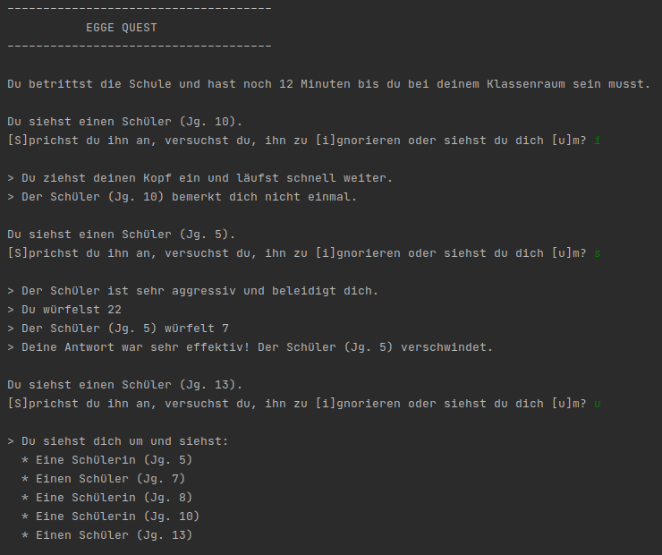

# Projekt 5: Egge Quest

Versucht, das abgebildete Programm selbst zu bauen. Der **weiße** Text ist die Ausgabe des Programms. Der **grüne** Text wird vom Benutzer eingegeben.

Die Aufgabe ist sehr umfangreich, deswegen gehen wir in einzelnen Schritten vor:

## Schritt 1:

**Game Loop**

Der Kern des Spiels sind zwei Zeilen (`Du siehst...` und `Sprichst...`), die wiederholt werden.
Schreibe den Code für diesen *Game Loop*. Die Funktionen für `ansprechen()`, `ignorieren()` und `umsehen()` folgen dann in den nächsten Schritten.
